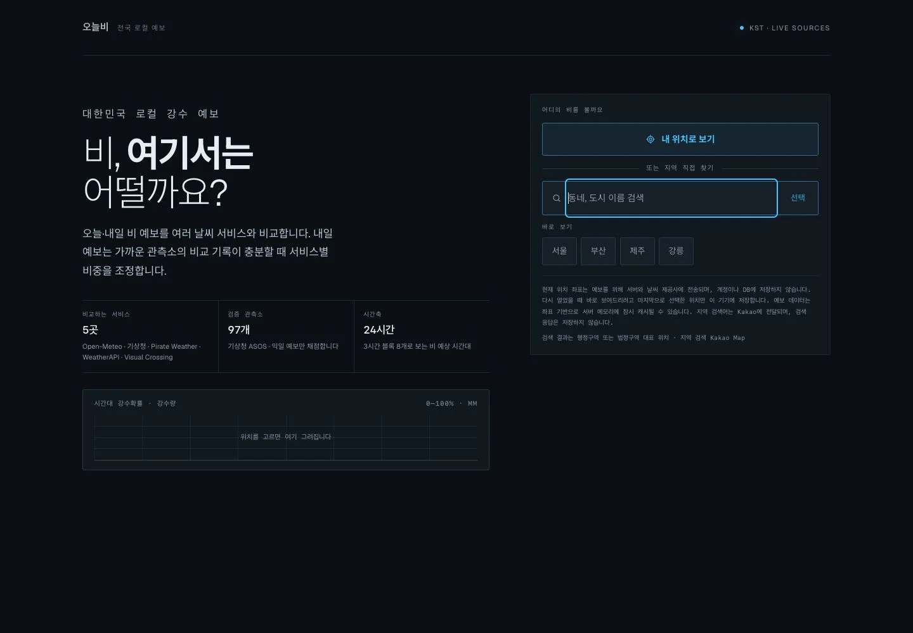
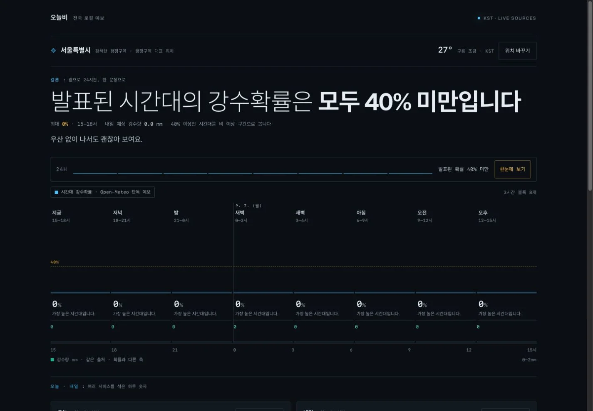
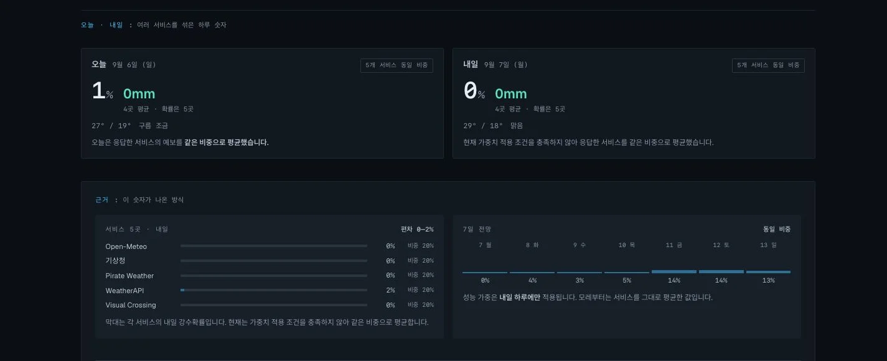
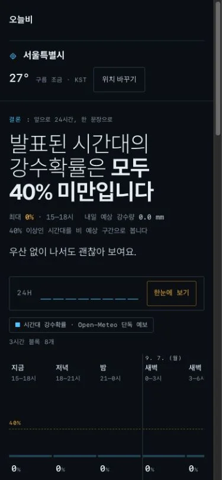
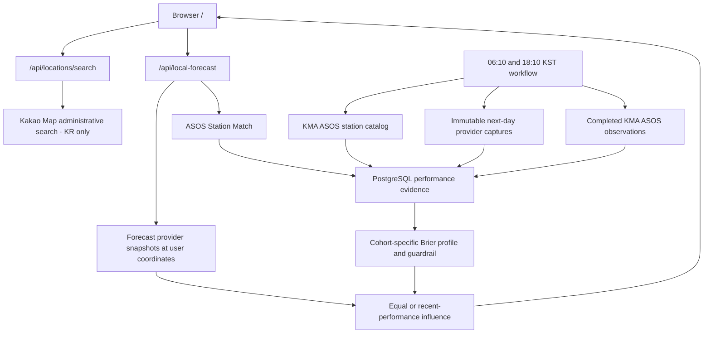

# 오늘비 · raintoday

[](https://nextjs.org/)
[](https://react.dev/)
[](https://www.typescriptlang.org/)
[](https://github.com/mhju0/raintoday/actions/workflows/local-performance.yml)

오늘비 ("rain today") is a South Korea local rain forecast. It leads with when rain starts and stops at the user's chosen coordinate, shows the next 24 hours as a horizontal time axis, carries today and tomorrow as two separately-calculated figures, and — when sufficient prospective evidence exists — adjusts each provider's influence on the next-day figure using the Recent Performance Profile from its KMA Station Match.

**Live demo:** [raintoday.vercel.app](https://raintoday.vercel.app)

The interface is Korean, for Korean users. The captions below describe what each screen shows.



*Nothing is requested until the visitor asks — the app never prompts for location automatically or infers it from an IP address. The three figures beside the two ways in are the same evidence the forecast ends on, stated before anyone commits a coordinate.*



*The heading answers when, not whether — a probability alone cannot tell someone leaving at 09:00 from someone leaving at 21:00, and it carries the window's own total amount, because 90% × 1mm and 50% × 20mm are different mornings. The ribbon is eight 3-hour blocks on a plain 0–100% scale, with the umbrella threshold drawn at the value it names and the rain window marked across every block it covers; beneath the bars, a second lane carries each block's own precipitation amount in the palette's third colour — the same provider's hourly amounts, on the lane's own mm scale, never the probability's axis. It is one provider's hourly series and says so, because the day figures below it are a blend of several. A block nobody published is hatched and shows a dash, never 0% — in either band.*



*Today and tomorrow are different calculations, so they are different surfaces and each card carries its own method tag — performance weighting is scored on next-day forecasts only and never claimed for today. On each card the amount stands beside the probability at equal weight, with its own provider count (fewer services publish an amount than a probability), and tomorrow's spread is attributed to the members that said it — 많으면/적으면 with provider names. Below them, on the receipts shelf — one quiet raised surface holding exactly what the 한눈에 fold governs: every provider with the figure it actually gave, drawn as its own bar so the bar tracks the number beside it, and the influence that figure was granted stated separately; then the longer outlook, which returns to a plain equal average from the day after tomorrow. The station the evidence comes from is named once, where the scoring is explained.*



*On a phone the sentence and both day cards stay whole; only the ribbon scrolls sideways, so nobody has to swipe to get the answer. A sparkline miniature of the timeline pins to the top through the full scroll — the graph is the navigation — carrying the 한눈에 ⇄ 전체 근거 toggle. A first visit opens already folded: the receipts collapse to one-line summaries of their own numbers, and either the toggle or a summary row unfolds them; the choice is remembered per device either way.*

## Product contract

- The forecast target is the user's exact submitted coordinate inside the supported South Korea service area, validated against official administrative boundaries.
- The user explicitly taps for browser geolocation or searches for a Korean place. The app does not prompt automatically or infer location from an IP address.
- User coordinates are used for the request and are not written to the performance database.
- Local performance is evidence from the KMA Station Match, not a claim that the station is the user's location.
- Rain probability is the initial accuracy target. Rain-amount error is reported separately and never substituted for probability accuracy.
- Until evidence passes every gate, the forecast uses equal influence among providers that supplied a valid value.

## How recent performance works

The [`local-performance`](.github/workflows/local-performance.yml) workflow runs at fixed 06:10 and 18:10 KST cohorts. For every active KMA ASOS station it can read, one run:

1. stores one completed daily precipitation observation — yesterday for the 18 KST cohort, two days back for the 06 KST one;
2. captures each available provider's next-day rain probability and amount;
3. freezes the adaptive and equal-weight outputs before the outcome exists;
4. writes the immutable capture and corrected station-day observation to PostgreSQL.

The two cohorts deliberately read different days. ASOS compiles a calendar day's summary some hours after midnight, not at it, so at 06 KST most of yesterday's rows do not exist yet — and a day the record has not compiled answers exactly the same NODATA as a station that has no row at all. Reading yesterday at 06 KST therefore recorded absences that were nothing of the kind. The early cohort reaches one day further back: both cohorts then read a published day, every date still gets two reads, and the later one is a real second chance rather than a premature one.

The station catalog is the run's only call to KMA apihub — the captures read the weather providers and the observations read data.go.kr — so an apihub outage no longer discards a cohort that never needed it. The catalog read backs off across three attempts, and if it still fails the run proceeds on the stations already recorded, reports `catalogSource: "store"`, and applies no activation or retirement until a catalog read succeeds again.

The observation read distinguishes a station ASOS has no row for from a request that was refused or dropped. Only the first is an absence; the second is counted in `observationsFailed`, named in `failures`, and fails the run. Throttled and dropped reads are retried with a short backoff, and a refused key is not retried at all.

The serving profile keeps the two capture cohorts separate. Provider probability performance uses all completed days—including dry days—with a 60-day operating window and a 14-day half-life. It reports Brier score, misses, false alarms, and rainy-day amount MAE. Public evidence also includes the latest seven-day Brier slice.

Learned influence requires at least 30 comparable captures per provider plus both wet and dry evidence. It ramps from equal to learned influence, applies provider floors and caps, and renormalizes over the providers that actually answered the current request. The Prospective Benchmark freezes adaptive and equal outputs before outcomes and suspends learning if the adaptive output regresses or lacks a fair comparison set.

Learned influence applies only to tomorrow, the lead time the Capture Cohorts measure. Days 2–7 remain an equal-provider outlook until those horizons have their own prospective evidence.

This supports the claim “weighted by recently observed local performance.” It does not yet support a claim that 오늘비 is more accurate overall; that requires accumulated prospective results.

### Seed evidence before live evidence exists

Prospective evidence takes about a month per station to mature, which would leave a first-time visitor on equal weights. To avoid that, a station can be seeded with **retrospective** evidence rebuilt from public archives: what each provider's underlying model forecast a day ahead, joined to the KMA ASOS observation for that date.

Seed evidence is a separate class from a Forecast Capture, and stays separate:

- It is scored on forecast **amount** and rain/no-rain outcome, because archives publish no probability. It never enters the Brier path.
- It is stored in its own table, carries no cohort and no frozen blend, and therefore can never reach the Prospective Benchmark.
- Its influence is capped at half the distance from equal weighting, because it rests on model proxies rather than each provider's own published forecast.
- It applies **only** while live evidence is immature. It never overrides a benchmark suspension, and mature live evidence supersedes it entirely.
- A provider with no honest archive proxy — currently WeatherAPI — is not seeded at all and keeps a neutral share rather than being demoted for lacking one.

The page says which of the two is driving the blend, and in seed mode shows the wet-day miss rate rather than a Brier table.

Backfill is a one-shot offline job, not something a visitor waits on:

```bash
npm run performance:seed -- --start=2025-06-01 --end=2025-08-31
```

## User flow

The forecast is the site, so it is served at `/`:

1. choose precise browser location or search for a Korean place;
2. read when rain starts and stops, as one sentence;
3. read the shape of the next 24 hours on a horizontal time axis — eight 3-hour blocks from a single named provider, probability above and that provider's own per-block amounts on a second lane below;
4. compare today and tomorrow, each tagged with how it was calculated;
5. inspect the Station Match, each provider's probability and influence, and the longer outlook;
6. inspect the evidence the weighting rests on — recent Brier scores, misses and false alarms per provider when live evidence is driving it, the wet-day miss rate when seed evidence is.

There is no ambient scene behind any of it. The page is one vertical read whose graph is also its navigation: a miniature of the timeline stays pinned while the evidence scrolls, carrying the 한눈에 ⇄ 전체 근거 density toggle. A first visit opens at 한눈에 — the folded sections leave one-line summaries carrying their own numbers, and tapping one unfolds the real section — while a stored choice is never overridden. Each section opens with a small mono label naming whose number it carries, and the timeline itself can be scrubbed (pointer or arrow keys) for one block's full reading. Beyond those, the summary rows, and "위치 바꾸기" there is nothing to operate.

## Architecture



Important boundaries:

- `lib/location.ts` validates Korean coordinates and converts them to KMA grid coordinates.
- `lib/providers/*` reads normalized provider snapshots at a requested location; `lib/providers/registry.ts` holds the single ordered list of compared providers, and the first one that answers becomes the comparison primary.
- `lib/performance/performance.ts` owns scoring, evidence gates, bounded weights, and the Prospective Benchmark.
- `lib/performance/store.ts` defines persistence; `lib/performance/postgres.ts` is the production adapter.
- `lib/performance/capture.ts` freezes one station/cohort prediction; `lib/performance/batch.ts` orchestrates the nationwide bounded run.
- `lib/localForecast.ts` combines exact-coordinate forecasts with nearby-station evidence without persisting user coordinates.
- `lib/performance/influence.ts` derives Effective Influence and the blend it produces, for both the capture and serving paths.
- `lib/performance/seed.ts` rebuilds retrospective day-ahead evidence from public archives; `lib/performance/seedScore.ts` scores it through the pure daily skill function in `lib/performance/precipSkill.ts`; `lib/performance/backfill.ts` orchestrates the one-shot offline run.
- `lib/localForecastView.ts` projects that response onto the flat contract `/api/local-forecast` returns, so the page never reads the domain model directly.
- `lib/forecast/blocks.ts` folds a now-anchored hourly series into eight 3-hour blocks; `lib/forecast/rainWindow.ts` reads the rain window out of them. A block with no published probability stays null rather than 0%, and an unpublished block ends a run rather than extending it.
- `app/api/local-forecast` and `app/api/locations/search` are rate-limited HTTP adapters.
- `lib/quotaRunway.ts` turns an upstream provider's remaining monthly quota into a runway, which the service-health check reads.

The served surface is small and closed: `/`, `/api/local-forecast`, `/api/locations/search`, `/icon.svg` and `/opengraph-image`, plus a 404. The retired `/atmosphere` and `/diagnostics` paths answer real HTTP redirects to `/`, independent of JavaScript; every other path 404s.

오늘비 grew out of a cinematic Seoul-only sky scene, and for a while carried a second, single-station precipitation-scoring pipeline beside the served one. Both are gone from the tree, together with the radar renderer and the air-quality reading that only that scene ever displayed. `lib/performance/` is now the only scoring pipeline in the repository, and it is the one a visitor reads. What was tried and why it was dropped is kept in [`docs/adr/`](docs/adr/) rather than in the code.

## Documents

| Document | Contents |
| --- | --- |
| [`CONTEXT.md`](CONTEXT.md) | Domain glossary: Forecast Location, Station Match, Capture Cohort, Effective Influence, and the rest |
| [`docs/weather-sources.md`](docs/weather-sources.md) | Provider contracts, configuration, cache behavior, failure modes, and attribution |
| [`docs/adr/`](docs/adr/) | Decision records: Korean location selection, the service-area boundary, the two station gates, and the retired second scoring pipeline |
| [`docs/research/`](docs/research/) | Source evidence: the SGIS boundary package's provenance, nationwide station coverage, why the AWS network is not adopted, and the elevation gate |
| [`lib/performance/README.md`](lib/performance/README.md) | The nationwide pipeline: live captures, retrospective seed evidence, and the mode gate |

## Stack

| Area | Technology |
| --- | --- |
| App | Next.js 16, React 19, TypeScript |
| Styling | Tailwind CSS 4 and custom responsive CSS |
| Forecasts | Open-Meteo, KMA, Pirate Weather, WeatherAPI — in that order |
| Ground truth | KMA ASOS daily precipitation |
| Persistence | PostgreSQL via Postgres.js |
| Scheduling | GitHub Actions: fixed KST evidence cohorts, and a six-hourly service check |
| Production dependencies | `next`, `react`, `react-dom`, `postgres`, and nothing else |

## Run locally

Requires Node.js 22 or later.

```bash
npm ci
install -m 600 .env.example .env.local
npm run dev
```

Open [http://localhost:3000](http://localhost:3000). Open-Meteo provides a keyless forecast baseline; configure `KAKAO_REST_API_KEY` for Korean administrative-area search and for naming a device coordinate. Optional weather providers activate when configured.

To collect regional performance, configure:

- `PERFORMANCE_DATABASE_URL`: a standard PostgreSQL connection URL;
- `KMA_APIHUB_KEY`: subscribed to the KMA surface-observation station catalog, which is all this key is used for;
- `KMA_OBSERVATION_API_KEY`: subscribed to the KMA ASOS daily service;
- optional provider credentials listed in [`.env.example`](.env.example), which declares every variable the code reads and nothing else.

Then run one fixed cohort:

```bash
npm run performance:capture -- --cohort=06
```

The scheduled workflow needs the same values as GitHub Actions secrets. If the database or station catalog is unavailable, the public forecast remains usable with an explicit equal-weight/no-evidence state.

### Service health

The scheduled evidence jobs prove the collector's credentials work; they say nothing about the served path, and production reads its keys from a different store. A separate check watches what a visitor actually gets, and the one upstream quota low enough for this project to reach:

```bash
npm run service:health
npm run service:health -- --target=local
```

It asserts the page answers, that a forecast still blends at least three of the four compared providers with a usable probability, and that administrative search still resolves. It also reads Pirate Weather's `ratelimit-*` headers and fails when what is left will not cover the scheduled pipeline's burn for the rest of the billing period plus a reserve held back for visitors — runway rather than a fixed threshold, because the same balance is comfortable on the last day of a period and fatal on the first. It runs every six hours from `.github/workflows/service-health.yml`. Targets are named rather than free-form URLs, so every address it requests is a constant in the script.

## Verification

```bash
npm run lint
npx tsc --noEmit
npm test
npm run build
```

`npm test` runs the library suite and a JSDOM component suite. The PostgreSQL performance store is held to the same executable contract as the in-memory one, but only when a disposable database is supplied:

```bash
PERFORMANCE_STORE_CONTRACT_URL=postgres://… npm test
```

The suite truncates that database's tables, so it must never be a production URL. Without it, the PostgreSQL contract is reported as skipped rather than passing.

Manual product checks should cover:

- location permission only after the location button is pressed;
- Korea-only place search and location switching;
- desktop and narrow mobile layouts;
- equal influence when performance evidence is missing or insufficient;
- station name, distance, sample depth, and recent scores when evidence is active;
- no user coordinates in PostgreSQL performance tables.

## Limits

- Initial launch covers South Korea and precipitation only.
- Exact-coordinate admission uses the official SGIS 시도 boundary geometry, so offshore and cross-border coordinates are rejected. The geometry is simplified to a 10 m tolerance, so a decision within roughly 25 m of the coastline can differ from the unsimplified source. Manual place search remains country-filtered to Korea.
- ASOS is the first observation network. AWS eligibility remains a later audited expansion.
- Initial shadow-validation policy defaults are: station distance at most 100 km; elevation difference at most 400 m; rain at 0.1 mm; miss/false-alarm decisions at 50%; at least 30 comparable captures with both wet and dry evidence; influence ramping through 60 captures; provider influence bounded to 5–60%; and an `exp(-12 × Brier)` score transform. These values, including the one-wet-day minimum, require validation against shadow data before marketing local coverage or performance guarantees.
- A location may have no eligible observation station even when forecasts are available.
- Provider availability and forecast horizon vary; missing values are omitted, never treated as zero.
- Prospective evidence needs time to accumulate. A station begins on retrospective seed evidence where a backfill has been run, and on equal influence otherwise.
- Seed evidence uses each provider's underlying model as a proxy (GFS for Pirate Weather, KMA's own model for KMA), not the provider's published product. It is capped, labelled as retrospective, and replaced by live evidence as soon as that matures.
- The offline backfill reads the station catalog from KMA apihub `stn_inf`; without that subscription it falls back to the committed catalog in `lib/performance/stationCatalog.ts`, which must be regenerated with `npm run performance:catalog` before nationwide seeding.
- Weather information is not suitable for safety-critical decisions.

## License

Copyright (c) 2026 Michael Ju. All rights reserved.
No license is granted for use, copying, modification, or distribution of this code as of 2026-07-30. This repository is public for portfolio review purposes only.
