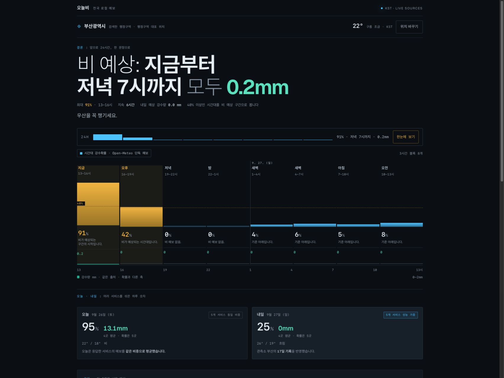

# 오늘비 · Raintoday

**Rain forecasts for South Korea, with the evidence behind tomorrow’s forecast.**

오늘비 helps people check when rain is expected and compare forecasts from five weather services. It pairs a 24-hour timeline from one named provider with daily comparisons and a tomorrow forecast that can use performance evidence from nearby KMA observation stations.

[Live app](https://raintoday.vercel.app) · [How forecasts are evaluated](https://raintoday.vercel.app/behind-the-data) · [Architecture decisions](docs/adr)

The interface is in Korean. Open the app and choose **서울**, **부산**, **제주**, or **강릉** to try it without sharing your device location.



*Busan, September 26, 2026: a live production forecast with a 91% peak rain chance and a visible rain window. The timeline is Open-Meteo’s forecast; the daily cards compare the responding providers. This is a dated screenshot, not current weather.*

## What it does

- Shows rain probability and rainfall amount on separate scales across eight three-hour blocks.
- Compares Open-Meteo, KMA, Pirate Weather, WeatherAPI, and Visual Crossing when available.
- Supports Korean area search, example locations, and opt-in device location.
- Explains provider influence, sample counts, and benchmark results in a station scoring record.

## Engineering highlights

**Forecasts saved before outcomes.** A scheduled collector stores immutable next-day forecasts and later pairs them with completed KMA ASOS observations in PostgreSQL. Morning and evening capture groups are scored separately.

**Evidence controls the blend.** Recent-performance influence applies only to tomorrow and requires sufficient wet/dry samples and a prospective benchmark no worse than equal weighting. Eligible archive evidence can provide a limited adjustment while recent records accumulate; otherwise the app uses equal influence. Retrospective evidence never enters the prospective benchmark.

**Explicit failure and privacy boundaries.** The server validates South Korea service-area coverage before contacting providers. Missing forecast values stay missing, unavailable providers are omitted, and an unavailable evidence store falls back to equal weighting. Device coordinates are sent for forecasts but are not written to the performance database; the browser remembers the selected location at reduced precision.

These mechanisms do **not** establish that the app is more accurate overall across locations and seasons.

## Architecture

```text
Browser → Next.js routes → shared provider snapshots → forecast view
                              ↑
                   station evidence and blend policy
                              ↑
GitHub Actions → immutable captures + observations → PostgreSQL
```

Next.js 16 · React 19 · TypeScript · Tailwind CSS 4 · PostgreSQL / Postgres.js · GitHub Actions · Vercel

The web app uses read-only database access; collection uses a separate writer. Provider order and blend calculations are shared between serving and capture.

## Run locally

Use Node.js 24.15+ within the 24.x line and npm.

```bash
npm ci
install -m 600 .env.example .env.local
npm run dev
```

Open [localhost:3000](http://localhost:3000). Open-Meteo provides a keyless baseline; configure `KAKAO_REST_API_KEY` for search and optional provider keys for additional forecasts. See [configuration](.env.example).

```bash
npm run verify
```

Verification runs lint, type checking, library/component/route tests, and a production build. CI also runs the PostgreSQL contract against a disposable database. The SQL contract truncates tables; never point `PERFORMANCE_STORE_CONTRACT_URL` at production.

## Scope and documentation

South Korea, precipitation, and a Korean-language interface. Station observations may differ from weather at the selected location. Provider availability and forecast horizons vary. Weather information is not suitable for safety-critical decisions.

Maintained for correctness, security, compatibility, and operations. New product work is outside the current maintenance scope.

- [Forecast contract and architecture](docs/FORECAST_CONTRACT.md)
- [Domain and terminology](CONTEXT.md)
- [Provider contracts](docs/weather-sources.md)
- [Verification guide](docs/VERIFYING.md)
- [Operations and recovery](docs/OPERATIONS.md)
- [Roadmap](docs/ROADMAP.md)

## License

Copyright © 2026 Michael Ju. All rights reserved. Public for portfolio review; no license is granted to use, copy, modify, or distribute the code.
