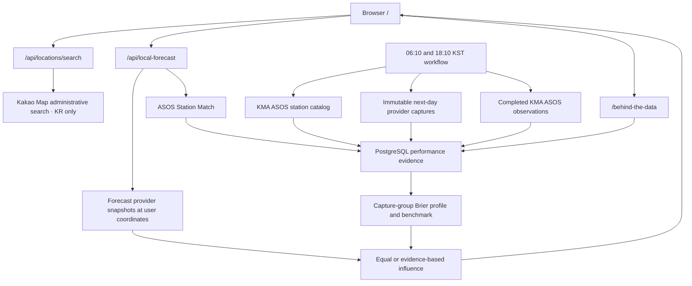

# Forecast contract and architecture

This reference contains the detailed behavior behind the [project overview](../README.md).

## Product contract

- Requests use the submitted coordinate, validated against the supported South Korea service area. Search results use an administrative area's representative point.
- Browser geolocation requires an explicit button press. The app does not infer location from an IP address.
- Coordinates are sent to the server and weather providers for the forecast. They are not written to the performance database. The device remembers the last selection at reduced precision; coordinate-based forecasts may be cached temporarily in server memory.
- Performance evidence comes from a KMA ASOS Station Match: local at up to 25 km, regional beyond 25 km within the existing 100 km eligibility limit. Conditions there can differ from those at the selected location.
- Probability accuracy and rain-amount error are scored separately.
- Tomorrow uses recent-performance weights only when evidence and benchmark checks pass. While recent evidence is immature, eligible archive evidence can provide a limited adjustment. Otherwise the responding providers receive equal influence.
- An unavailable provider is omitted. An unavailable evidence store causes equal weighting; a forecast that cannot be loaded displays an error and retry control.

## How recent performance works

The [`local-performance`](../.github/workflows/local-performance.yml) workflow is scheduled at 06:10 and 18:10 KST. For each active KMA ASOS station it can read, a run:

1. stores completed daily observations, using yesterday for the 18 KST group and two days back for the 06 KST group;
2. captures provider forecasts for the next day;
3. computes the adaptive and equal-weight forecasts before the outcome exists;
4. stores the immutable forecasts and station-day observations in PostgreSQL.

Morning and evening capture groups are scored separately. A group identifies the scheduled slot; collection may start late. The scoring record reports the measured time between collection and the target day. Providers within a capture share the collection time, but their different update schedules and forecast horizons can still affect the comparison. [Issue 118](https://github.com/mhju0/raintoday/issues/118) records the investigation and decision.

The morning group reads an older observation date because the previous day's ASOS summary may not yet be published. Observation request failures are faults, never missing observations or dry days. Transient failures receive bounded retries; rejected credentials are not retried.

The station catalog is the collector's only KMA apihub request. If catalog retries fail, collection can continue using stored stations without activating or retiring any. Forecast providers and the data.go.kr observation API are read separately.

A compared provider's read fault prevents that capture from being stored. A retry cannot fill in an immutable capture later. The run tolerates a limited share of failed captures and allows up to five fresh-runner attempts, targeting 0, 10, 25, 40 and 55 minutes from the first attempt. The authoritative verdict fails if no attempt succeeds. An outage breaker can abandon an already-failing pass after sustained transport faults; abandoned work cannot make a cohort pass. See [operations](OPERATIONS.md) for recovery details.

Probability scores use completed days, including dry days, within a 60-day operating window and a 14-day half-life. The page reports Brier scores, misses, false alarms, rainy-day amount MAE, and a separate seven-day Brier slice.

Learned influence requires at least 30 comparable captures per provider, with both wet and dry evidence. It increases gradually through 60 captures and uses provider floors and caps. A provider without sufficient history keeps a neutral share. Serving renormalizes influence across providers that supplied the requested value.

The Prospective Benchmark compares adaptive and equal forecasts stored before the outcome. It passes when enough comparable samples exist and the adaptive Brier score is no worse than the equal score, including ties. Insufficient samples or regression suspend learned weighting. The condition is checked when evidence is read.

Learned influence applies only to tomorrow. Today and days 2–7 use equal-provider averages. These records do not yet establish that 오늘비 is more accurate overall across locations and seasons.

### Archive evidence while recent records accumulate

A station can be seeded with retrospective evidence: an underlying model's day-ahead forecast from a public archive, paired with the KMA ASOS observation. This stays separate from prospective Forecast Captures:

- Seed scores use rainfall amount and rain/no-rain outcomes. They never enter the probability Brier score or Prospective Benchmark.
- Seed comparisons have their own table, without a capture group or frozen blend.
- Seed influence moves halfway from equal weights toward the weights calculated from archive scores.
- Mature recent evidence replaces the seed. Seed evidence cannot override a benchmark suspension.
- Providers without a suitable archive proxy keep a neutral share. WeatherAPI has no published model lineage with a public archive. Visual Crossing's hourly archive cost exceeds this project's backfill budget.

The forecast identifies archive-based weighting and shows provider sample counts, missed wet days and false alarms. The separate prospective comparison has its own count and verdict.

Backfill is an offline operation that writes evidence:

```bash
npm run performance:seed -- --start=2025-06-01 --end=2025-08-31
```

## User flow

1. Choose device location, search for a Korean area, or select an example.
2. Read the expected rain window and next 24 hours from the named hourly provider. The rain-window threshold is 40% or higher. Lower values do not mean rain is impossible; unpublished values remain labelled as missing.
3. Compare today and tomorrow, each labelled with its calculation method. Rainfall amount has its own provider count.
4. Expand the provider comparison, longer outlook and scoring evidence if needed.
5. Open the evidence-status link to the station's [`/behind-the-data`](https://raintoday.vercel.app/behind-the-data) record. Device-location links carry only the public station ID; area links carry the area's representative coordinate.

A first visit opens the supporting evidence folded under 한눈에. A summary row or the pinned control expands it, and the device remembers the choice. Pointer movement or arrow keys inspect individual timeline blocks.

## Architecture



| Module | Responsibility |
| --- | --- |
| `lib/location.ts` | Service-area admission before KMA grid conversion or provider requests |
| `lib/exampleLocations.ts` | Tested examples using Kakao representative points |
| `lib/providers/` | Provider snapshots and the ordered registry shared by capture and serving |
| `lib/performance/performance.ts` | Scores, evidence requirements, weights and the Prospective Benchmark |
| `lib/performance/store.ts`, `postgres.ts` | Persistence contract and production adapter |
| `lib/performance/capture.ts`, `batch.ts` | Immutable captures and nationwide collection |
| `lib/performance/influence.ts` | Shared blend calculation for capture and serving |
| `lib/performance/seed.ts`, `seedScore.ts`, `precipSkill.ts`, `backfill.ts` | Archive reconstruction, scoring and offline backfill |
| `lib/localForecast.ts` | Coordinate forecasts, nearby-station evidence and shared record reads |
| `lib/localForecastView.ts` | Public forecast response and display fields |
| `lib/forecast/` | Three-hour blocks and threshold-based rain windows |
| `app/api/` | Rate-limited forecast and location-search HTTP adapters |
| `app/behind-the-data`, `lib/behindTheData.ts` | Per-request scoring page and its view model |
| `lib/quotaRunway.ts` | Provider quota runway used by the service-health check |

The served surface is `/`, `/behind-the-data`, `/api/local-forecast`, `/api/locations/search`, `/icon.svg`, `/opengraph-image`, and a Korean 404 page. Retired `/atmosphere` and `/diagnostics` URLs redirect to `/`.


## Limits

- South Korea and precipitation only.
- Service-area admission uses official SGIS 시도 geometry simplified to a 10 m tolerance. Decisions within roughly 25 m of the coastline may differ from the unsimplified geometry. Manual search is country-filtered to Korea.
- ASOS is the observation network. AWS adoption remains outside the current scope.
- Scoring policy defaults are: rain at 0.1 mm; miss/false-alarm decisions at 50%; at least 30 comparable captures with both wet and dry evidence; influence ramping through 60 captures; provider influence bounded to 5–60%; and an `exp(-12 × Brier)` score transform. A test checks these documented values against the policy object.
- Station eligibility requires distance at most 100 km and elevation difference at most 400 m. The coverage study's 36 administrative centres had a maximum nearest-station distance of 30.2 km; this is not a measurement of every inhabited location. See [ADR 0005](adr/0005-station-proximity-is-language-not-eligibility.md), [ADR 0006](adr/0006-the-elevation-gate-is-non-binding.md), and the [coverage study](research/nationwide-verification-coverage.md).
- A location can have forecasts but no eligible observation station.
- Provider availability and horizon vary. Missing values are omitted, never treated as zero.
- Prospective evidence takes time to accumulate. A station uses eligible archive evidence while recent evidence is immature, and equal influence otherwise.
- Seed evidence uses underlying models, such as GFS for Pirate Weather and KMA's model for KMA, as proxies for the provider's published product.
- Offline backfill falls back to the committed station catalog when KMA apihub `stn_inf` is unavailable. Regenerate it with `npm run performance:catalog` before nationwide seeding.
- Weather information is not suitable for safety-critical decisions.

